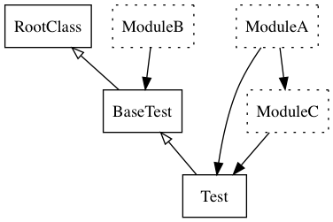

#This is still a WIP

# TODO
1. get example simple project added to specs
2. get example rails project added to specs

# RubyErd

RubyErd is a gem meant to walk the classes and modules in your projects creating a GraphViz diagram.
The RubyErd gem can be used with a single ruby file or a ruby project like rails.
This project was heavily influenced by [RailRoady](https://github.com/preston/railroady).

The end goal of this gem is to provide more utility to the RailRoady gem to create
an ERD that not only provides the ActiveRecord associations but also any modules
and class that are deeply nested.



## Installation

Add this line to your application's Gemfile:

```ruby
gem 'ruby_erd'
```

And then execute:

    $ bundle

Or install it yourself as:

    $ gem install ruby_erd

## Usage

To generate the example from above you can run the following.

```
bin/ruby-erd -o test.png -d spec -c spec/examples/class_02.rb -k Test
```


```
Usage:  [options] command

Common options:
    -i, --include file1[,fileN]      Include only given files
    -e, --exclude file1[,fileN]      Exclude given files
    -k, --klasses class1[,classN]    Names of classes to build a diagram for
    -v, --verbose                    Enable verbose output
                                       (produce messages to STDOUT)
    -o, --output FILE                Write diagram to file FILE
    -d, --dir PATH                   Set PATH as the directory project is in (defaults to app)
    -r, --root PATH                  Set PATH as the application root

    -c, --config FILE                File to load environment (defaults to config/environment)
```

## Development

After checking out the repo, run `bin/setup` to install dependencies. Then, run `rake spec` to run the tests. You can also run `bin/console` for an interactive prompt that will allow you to experiment.

To install this gem onto your local machine, run `bundle exec rake install`. To release a new version, update the version number in `version.rb`, and then run `bundle exec rake release`, which will create a git tag for the version, push git commits and tags, and push the `.gem` file to [rubygems.org](https://rubygems.org).

## Contributing

Bug reports and pull requests are welcome on GitHub at https://github.com/[USERNAME]/ruby_erd. This project is intended to be a safe, welcoming space for collaboration, and contributors are expected to adhere to the [Contributor Covenant](http://contributor-covenant.org) code of conduct.

## License

The gem is available as open source under the terms of the [MIT License](https://opensource.org/licenses/MIT).

## Code of Conduct

Everyone interacting in the RubyErd project’s codebases, issue trackers, chat rooms and mailing lists is expected to follow the [code of conduct](https://github.com/[USERNAME]/ruby_erd/blob/master/CODE_OF_CONDUCT.md).
